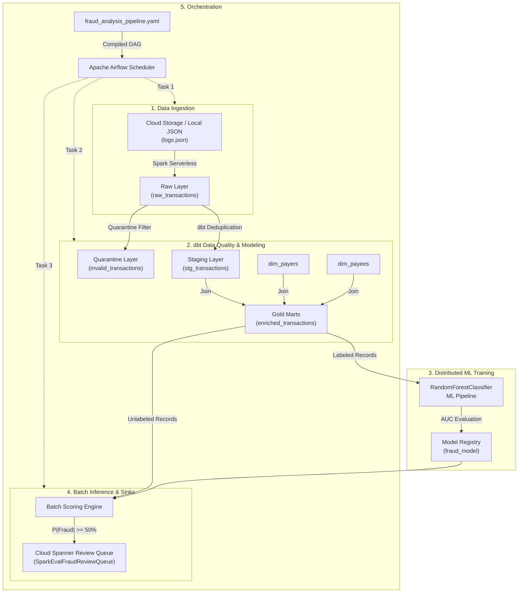

# 🛡️ Cymbal Financial: Fraud Detection Pipeline with Data Agent Kit & Antigravity IDE

[](https://docs.cloud.google.com/data-cloud-extension/antigravity/overview)
[](https://antigravity.google/product/antigravity-ide)
[](https://www.getdbt.com/)
[](https://airflow.apache.org/)
[](https://www.python.org/)

An end-to-end analytical and machine learning data pipeline for real-time and batch fraud detection built inside the **Google Antigravity IDE** using the **Google Cloud Data Agent Kit (DAK)**. 

This repository implements the [Google Developers Fraud Detection Codelab](https://codelabs.developers.google.com/dak-data-science-antigravity-ide?hl=en) with **Dual Execution Support**:
1. **Google Cloud Production Mode**: PySpark on Managed Service for Apache Spark (Serverless Spark), BigQuery, Cloud Spanner, and Managed Service for Apache Airflow (Cloud Composer).
2. **Zero-Credit Local Simulation Mode**: Local high-performance runner executing over real Cymbal Financial clearinghouse datasets via DuckDB/SQLite + Scikit-Learn/PySpark + Streamlit.

---

## 🏛️ Architecture & Data Flow



---

## 📁 Repository Structure

```text
├── notebooks/
│   ├── 01_ingestion.ipynb         # PySpark raw transaction logs ingestion
│   ├── 02_training.ipynb          # Distributed Random Forest ML training pipeline
│   └── 03_inference.ipynb         # Batch scoring & Cloud Spanner queue sink
├── dbt_project/
│   ├── dbt_project.yml            # dbt project configuration
│   ├── profiles.yml               # Dual target profile (BigQuery & DuckDB)
│   └── models/
│       ├── staging/
│       │   ├── stg_transactions.sql     # Deduplication by transaction_id
│       │   └── invalid_transactions.sql # Quarantining corrupted/null records
│       ├── marts/
│       │   └── enriched_transactions.sql# Dimensional joins (payers + payees)
│       └── schema.yml             # Schema uniqueness & not-null quality tests
├── dags/
│   └── fraud_analysis_dag.py      # Apache Airflow DAG script
├── data/
│   ├── logs.json                  # Sample clearinghouse streaming transaction logs
│   ├── payers.csv                 # Payer entity directory & risk metrics
│   └── payees.csv                 # Payee merchant directory & risk metrics
├── deployment.yaml                # Orchestration environment registry
├── fraud_analysis_pipeline.yaml   # DAK declarative orchestration pipeline definition
├── local_runner.py                # Zero-credit local pipeline execution harness
├── app.py                         # Interactive Streamlit audit dashboard
└── README.md                      # Project documentation
```

---

## 🚀 Quick Start (Zero-Credit Local Execution)

### 1. Prerequisites
Clone the repository and install dependencies:
```bash
git clone https://github.com/faith-ayomide/Fraud-Detection-with-data-agent-kit-antigravity-ide.git
cd Fraud-Detection-with-data-agent-kit-antigravity-ide
pip install -r requirements.txt # or: pip install pandas scikit-learn duckdb streamlit plotly
```

### 2. Run the Full Pipeline
Execute all 4 stages (Ingestion $\rightarrow$ dbt $\rightarrow$ ML Training $\rightarrow$ Spanner Inference) locally:
```bash
python local_runner.py --stage all
```

Output:
```text
====================================================================
   Cymbal Pay Fraud Pipeline: Local Zero-Credit Execution Engine    
====================================================================

=== [STAGE 1] Ingest Raw Clearinghouse Logs ===
[OK] Ingested 26,898 raw transaction records.
[OK] Loaded 600 payers and 600 payees.

=== [STAGE 2] dbt Deduplication, Quarantine & Enriched Marts ===
[PASS] test_unique_stg_transactions_transaction_id
[PASS] test_not_null_stg_transactions_transaction_id
[PASS] test_unique_enriched_transactions_transaction_id
[OK] Materialized 26,783 enriched records (109 quarantined).

=== [STAGE 3] Train Distributed Random Forest Classifier ===
  Area Under ROC (AUC)  : 0.8483
  Area Under PR (AUPRC) : 0.4533
  Accuracy              : 91.15%

=== [STAGE 4] Batch Inference & Cloud Spanner Review Queue Sink ===
[OK] Flagged 32 High-Risk Transactions (Probability >= 50%) for Cloud Spanner audit queue.
```

### 3. Launch Interactive Web Dashboard
Explore data layers, view the ML ROC curve, and inspect the live Spanner compliance queue:
```bash
streamlit run app.py
```

---

## ☁️ Google Cloud Production Deployment

When deploying to Google Cloud Platform:
1. In the **Antigravity IDE**, open the **Google Cloud Data Agent Kit** panel.
2. Select your GCP Project ID and Region (`us-central1`).
3. Run [`notebooks/01_ingestion.ipynb`](notebooks/01_ingestion.ipynb) on **Serverless Spark**.
4. Run `dbt build` in [`dbt_project/`](dbt_project/) to materialize BigQuery tables.
5. Deploy the pipeline to **Managed Airflow** directly from the visual canvas via [`fraud_analysis_pipeline.yaml`](fraud_analysis_pipeline.yaml).

---

## 📄 License
This project is licensed under the Apache 2.0 License - see the [LICENSE](LICENSE) file for details.
